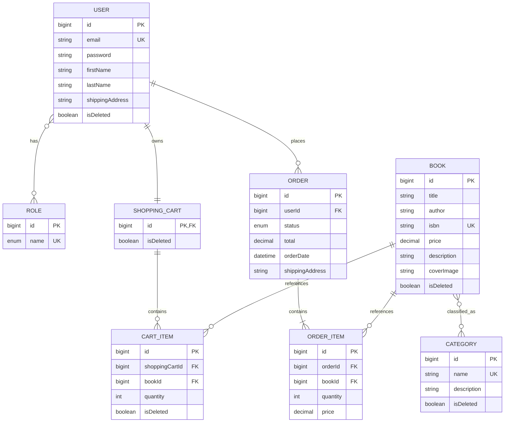

# Book Storage API

Book Storage is a RESTful API for an online bookstore. It allows users to browse books and categories, register and authenticate with JWT, manage a shopping cart, and place orders.

The goal of the project is to demonstrate the practical use of Spring Boot for building a secure backend application with a clear architecture, role-based access control, database migrations, and interactive API documentation.

## Features

- User registration and JWT authentication
- Viewing books and categories
- Creating, updating, and deleting books and categories as an administrator
- Adding, updating, and removing books in a shopping cart
- Creating orders from the current shopping cart
- Viewing the authenticated user's orders and order items
- Updating order statuses as an administrator
- Interactive API documentation with Swagger UI

## Technologies

- Java 17
- Spring Boot 3
- Spring Web
- Spring Security
- JWT (JSON Web Token)
- Spring Data JPA and Hibernate
- MySQL
- Liquibase
- MapStruct
- Lombok
- Swagger/OpenAPI
- Maven
- JUnit 5 and Mockito
- Testcontainers
- Docker Compose

## Getting Started

### Prerequisites

Install the following tools before running the project:

- Git
- JDK 17 or later
- Docker and Docker Compose

Maven does not have to be installed separately because the repository includes Maven Wrapper.

### Clone and configure the project

1. Clone the repository and open the project directory:

   ```bash
   git clone https://github.com/IgorArsionov/BookStorage.git
   cd BookStorage
   ```

2. Create a `.env` file in the project root:

   ```env
   MYSQLDB_USER=book_user
   MYSQLDB_PASSWORD=book_password
   MYSQLDB_DATABASE=book_storage
   MYSQLDB_ROOT_PASSWORD=root_password
   MYSQLDB_LOCAL_PORT=3307
   MYSQLDB_DOCKER_PORT=3306

   SPRING_LOCAL_PORT=8080
   SPRING_DOCKER_PORT=8080
   DEBUG_PORT=5005
   ```

   Change passwords before using the application outside a local development environment. If a listed host port is already occupied, choose another `*_LOCAL_PORT` value.

3. Build the application:

   ```bash
   ./mvnw clean package
   ```

   On Windows:

   ```powershell
   mvnw.cmd clean package
   ```

4. Start MySQL and the application:

   ```bash
   docker compose up --build
   ```

5. The API is available at `http://localhost:8080` when the example environment values are used.

6. Stop the containers when finished:

   ```bash
   docker compose down
   ```

## Security

The application uses stateless JWT-based authentication. After a successful login, send the returned token with each protected request:

```http
Authorization: Bearer <token>
```

The project includes two roles:

- `USER` — can browse the catalog and manage their own cart and orders.
- `ADMIN` — can also create, update, and delete books and categories, and update order statuses.

The `/auth/**`, `/swagger-ui/**`, and `/v3/api-docs/**` endpoints are publicly accessible. All other endpoints require authentication.

## Data Model



## Swagger / OpenAPI

After starting the application, open:

- [Swagger UI](http://localhost:8080/swagger-ui/index.html)
- [OpenAPI JSON](http://localhost:8080/v3/api-docs)

Register or log in, copy the returned JWT, click **Authorize** in Swagger UI, and enter the token as `Bearer <token>` if required by the displayed security scheme.

## Postman Collection

An importable collection containing all API endpoints is included in the repository:

- [`postman/BookStorage.postman_collection.json`](postman/BookStorage.postman_collection.json)

After importing it into Postman:

1. Ensure the API is running.
2. Run **Register** or use an existing account.
3. Run **Login**. Its test script automatically stores the returned JWT in the `token` collection variable.
4. Update resource ID variables when needed (`bookId`, `categoryId`, `cartItemId`, `orderId`, and `orderItemId`).

The default `baseUrl` is `http://localhost:8080`.

## Main API Endpoints

### Authentication

| Method | Endpoint | Access | Description |
|---|---|---|---|
| `POST` | `/auth/register` | Public | Register a new user |
| `POST` | `/auth/login` | Public | Authenticate and receive a JWT |

### Books

| Method | Endpoint | Access | Description |
|---|---|---|---|
| `GET` | `/books` | `USER`, `ADMIN` | Get a paginated list of books |
| `GET` | `/books/{id}` | `USER`, `ADMIN` | Get a book by ID |
| `POST` | `/books` | `ADMIN` | Create a book |
| `PUT` | `/books/{id}` | `ADMIN` | Update a book |
| `DELETE` | `/books/{id}` | `ADMIN` | Soft-delete a book |

### Categories

| Method | Endpoint | Access | Description |
|---|---|---|---|
| `GET` | `/categories` | `USER`, `ADMIN` | Get all categories |
| `GET` | `/categories/{id}` | `USER`, `ADMIN` | Get a category by ID |
| `GET` | `/categories/{id}/books` | `USER`, `ADMIN` | Get books in a category |
| `POST` | `/categories` | `ADMIN` | Create a category |
| `PUT` | `/categories/{id}` | `ADMIN` | Update a category |
| `DELETE` | `/categories/{id}` | `ADMIN` | Soft-delete a category |

### Shopping Cart

| Method | Endpoint | Access | Description |
|---|---|---|---|
| `GET` | `/cart` | `USER`, `ADMIN` | Get the current user's cart |
| `POST` | `/cart` | `USER`, `ADMIN` | Add a book to the cart |
| `PUT` | `/cart/items/{cartItemId}` | `USER`, `ADMIN` | Update a cart item |
| `DELETE` | `/cart/items/{cartItemId}` | `USER`, `ADMIN` | Remove a cart item |

### Orders

| Method | Endpoint | Access | Description |
|---|---|---|---|
| `POST` | `/orders` | `USER`, `ADMIN` | Create an order from the current cart |
| `GET` | `/orders` | `USER`, `ADMIN` | Get the current user's orders |
| `PATCH` | `/orders/{id}` | `ADMIN` | Update an order status |
| `GET` | `/orders/{orderId}/items` | `USER`, `ADMIN` | Get items in an order |
| `GET` | `/orders/{orderId}/items/{itemId}` | `USER`, `ADMIN` | Get a specific order item |

Paginated endpoints support standard Spring pagination parameters such as `page`, `size`, and `sort`.

## Challenges and Solutions

### Role-Based Access Control

**Challenge:** Restricting access to API endpoints based on user roles.

**Solution:** Implemented Spring Security method authorization with `@PreAuthorize` and `USER`/`ADMIN` roles.

### Stateless Authentication

**Challenge:** Building secure authentication without storing user sessions on the server.

**Solution:** Implemented JWT authentication. The client sends the issued token with protected requests in the `Authorization` header.

### API Documentation

**Challenge:** Making the API easy to explore and test.

**Solution:** Integrated Swagger/OpenAPI for interactive endpoint and data-model documentation and added a Postman collection with prepared requests.

### Database Schema Management

**Challenge:** Applying database schema changes consistently across environments.

**Solution:** Used Liquibase for version-controlled, repeatable database migrations.

## Author

**Ihor Arsonov**  
Java Backend Developer
